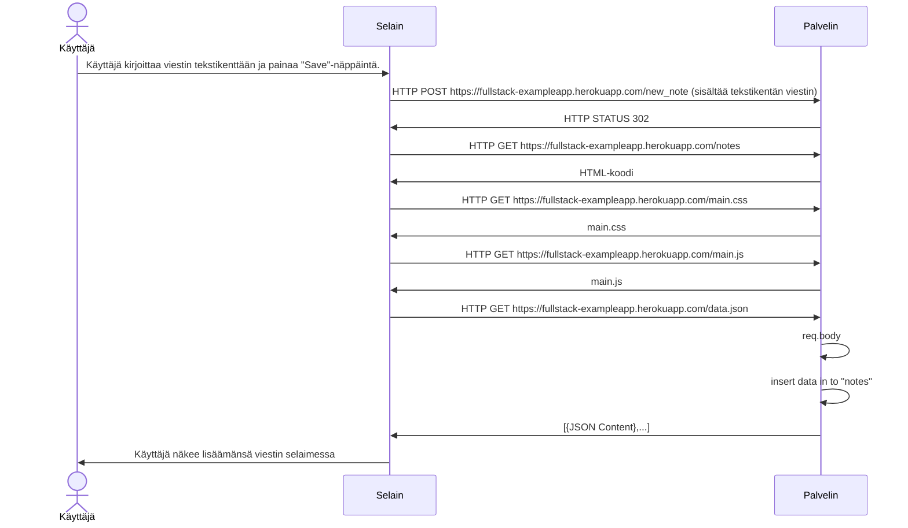

```mermaid
sequenceDiagram
  actor Käyttäjä
  participant Selain
  participant Palvelin

  Käyttäjä->>Selain: Käyttäjä kirjoittaa viestin tekstikenttään ja painaa "Save"-näppäintä.
  Selain->>Palvelin: HTTP POST https://fullstack-exampleapp.herokuapp.com/new_note (sisältää tekstikentän viestin)
  Palvelin->>Selain: HTTP STATUS 302
  Selain->>Palvelin: HTTP GET https://fullstack-exampleapp.herokuapp.com/notes
  Palvelin->>Selain: HTML-koodi
  Selain->>Palvelin: HTTP GET https://fullstack-exampleapp.herokuapp.com/main.css
  Palvelin->>Selain: main.css
  Selain->>Palvelin: HTTP GET https://fullstack-exampleapp.herokuapp.com/main.js
  Palvelin->>Selain: main.js
  Selain->>Palvelin: HTTP GET https://fullstack-exampleapp.herokuapp.com/data.json
  Palvelin->>Palvelin: req.body
  Palvelin->>Palvelin: insert data in to "notes"
  Palvelin->>Selain: [{JSON Content},...]
  Selain->>Käyttäjä: Käyttäjä näkee lisäämänsä viestin selaimessa
```
